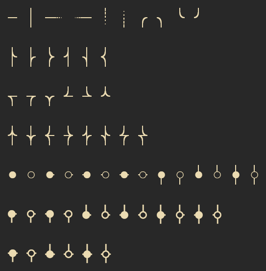
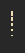
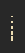
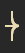
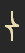
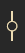

# Flog Symbols

This font contains symbols for rendering Git branches.
It is provided for font patching purposes.

The range of symbols is `U+F5D0` through `U+F5FB`.

These symbols can be used with [vim-flog](https://github.com/rbong/vim-flog).

## Symbol table

| code   | img                      | char |
|--------|--------------------------|------|
| U+f5d0 |  |     |
| U+f5d1 |  |     |
| U+f5d2 |  |     |
| U+f5d3 |  |     |
| U+f5d4 |  |     |
| U+f5d5 |  |     |
| U+f5d6 |  |     |
| U+f5d7 |  |     |
| U+f5d8 |  |     |
| U+f5d9 |  |     |
| U+f5da |  |     |
| U+f5db |  |     |
| U+f5dc |  |     |
| U+f5dd |  |     |
| U+f5de |  |     |
| U+f5df |  |     |
| U+f5e0 |  |     |
| U+f5e1 |  |     |
| U+f5e2 |  |     |
| U+f5e3 |  |     |
| U+f5e4 |  |     |
| U+f5e5 |  |     |
| U+f5e6 |  |     |
| U+f5e7 |  |     |
| U+f5e8 |  |     |
| U+f5e9 |  |     |
| U+f5ea |  |     |
| U+f5eb |  |     |
| U+f5ec |  |     |
| U+f5ed |  |     |
| U+f5ee |  |     |
| U+f5ef |  |     |
| U+f5f0 |  |     |
| U+f5f1 |  |     |
| U+f5f2 |  |     |
| U+f5f3 |  |     |
| U+f5f4 |  |     |
| U+f5f5 |  |     |
| U+f5f6 |  |     |
| U+f5f7 |  |     |
| U+f5f8 |  |     |
| U+f5f9 |  |     |
| U+f5fa |  |     |
| U+f5fb |  |     |
